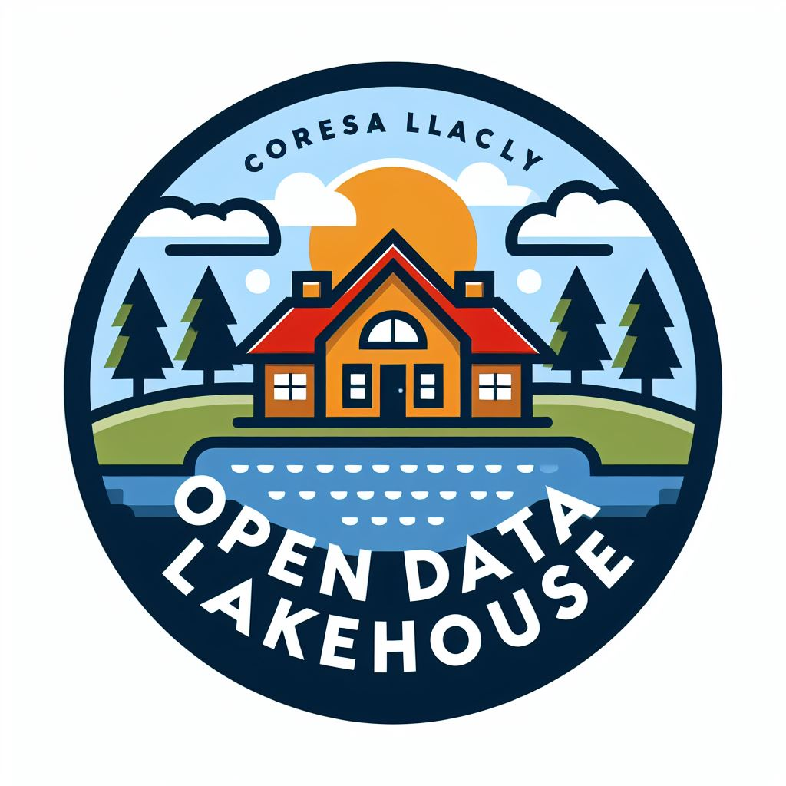

<h1 align="center">Data Lakehouse</h1>
<p align="center">
    
</p>
<p align="center">
    Open Data Lakehouse Platform with specialized tools for data analytics
</p>

<a name="table-of-contents"></a>
## Table of contents
-   [Table of contents](#table-of-contents)
-   [Description](#description)
-   [System Architecture](#system-architecture)
-   [Lakehouse Architecture](#lakehouse-architecture)
-   [Quick start](#quick-start)
    -   [Requirements](#requirements)
    -   [Installation](#installation)
    -   [Usage](#usage)
        -   [Access services](#access-services)
        -   [Prepare data](#prepare-data)
        -   [Orchestrate pipeline](#orchestrate-pipeline)
        -   [Query data](#query-data)
    -   [Clean up](#clean-up)
-   [Todo](#todo)


<a name="description"></a>
## Description
**Warning**: This project is still a work in progress. It is not yet ready for production use. Please use it at your own risk.  

This project is a data lakehouse platform with specialized tools for data analytics. The platform is built on top of the following components:
- [Apache Spark](https://spark.apache.org/): Apache Spark is a unified analytics engine for big data processing, with built-in modules for streaming, SQL, machine learning and graph processing.
- [Delta Lake](https://delta.io/): Delta Lake is an open-source storage layer that brings ACID transactions to Apache Spark and big data workloads.
- [Apache Airflow](https://airflow.apache.org/): Apache Airflow is a platform to programmatically author, schedule and monitor workflows.
- [MinIO](https://min.io/): MinIO is a high performance, distributed object storage system. It is software-defined, runs on industry standard hardware and is 100% open source under the Apache V2 license.
- [Metabase](https://www.metabase.com/): Metabase is the easy, open source way for everyone in your company to ask questions and learn from data.
- [Hive Metastore](https://cwiki.apache.org/confluence/display/Hive/Hive+Metastore): The Hive metastore is a central repository of Hive metadata. It stores metadata for Hive tables (like their schema and location) and partitions in a relational database.
- [Mlflow](https://mlflow.org/): MLflow is an open source platform for the complete machine learning lifecycle. It is designed to work with any machine learning library and to be platform agnostic.
- [dbt](https://www.getdbt.com/): dbt (data build tool) enables data analysts and engineers to transform their data using the same practices that software engineers use to build applications.


<a name="system-architecture"></a>
## System Architecture
The system architecture is shown in the following diagram:


Here we using the stable technologies to build the data lakehouse platform such as Apache Spark, Delta Lake, Apache Airflow, MinIO, Metabase, Hive Metastore, Mlflow, dbt. The platform is designed to be scalable, reliable, and easy to use. It can be used to store, process, and analyze large amounts of data.  
Althought the platform is built on top of the stable technologies, it is still a work in progress. We are constantly working on improving the platform and adding new features. If you have any suggestions or feedback, please let us know.  
We hope that the platform will be useful to you and help you with your data analytics needs.

<a name="lakehouse-architecture"></a>
## Lakehouse Architecture
The lakehouse architecture is shown in the following diagram:
<p align="center">
    
</p>
The lakehouse architecture is a new approach to data management that combines the best of data lakes and data warehouses. It provides the scalability and flexibility of a data lake, with the reliability and performance of a data warehouse.

Here we have four layers in the lakehouse architecture:
- **Table Format**: The table format layer is responsible for defining the schema of the data. It specifies the structure of the data, such as the columns, data types, and constraints. The table format layer is implemented using Delta Lake, which provides ACID transactions and schema enforcement. In the furture, maybe we will shift to Iceberg if it is more stable.
- **Metadata**: The metadata layer is responsible for storing metadata about the data. It includes information about the data, such as the location, format, and schema. The metadata layer is implemented using the Hive Metastore, which provides a central repository for storing metadata.
- **Compute Engine**: The compute engine layer is responsible for processing the data. It includes tools for running queries, transforming data, and training machine learning models. The compute engine layer is implemented using Apache Spark, which provides a unified analytics engine for big data processing.
- **Data Lake**: The data lake layer is responsible for storing the data. It includes tools for storing, managing, and accessing large amounts of data. The data lake layer is implemented using MinIO, which provides a high performance, distributed object storage system.

For people who are not familiar with the concept of a lakehouse, it is a new approach to data management that combines the best of data lakes and data warehouses. It provides the scalability and flexibility of a data lake, with the reliability and performance of a data warehouse.
If you are interested in learning more about the lakehouse architecture, we recommend checking out the following resources:
- [Lakehouse (Databricks)](https://docs.databricks.com/en/lakehouse/index.html)
- [Lakehouse (Google Cloud)](https://cloud.google.com/discover/what-is-a-data-lakehouse)

<a name="quick-start"></a>
## Quick start

<a name="requirements"></a>
### Requirements
You need to have the following tools installed on your machine:
- [Docker](https://www.docker.com/)

<a name="installation"></a>
### Installation
- Clone the repository
```bash
git clone https://github.com/harrydevforlife/building-lakehouse.git
```

Update the environment variables in the `.env` file.
Then run the following commands to start the platform:
```bash
docker compose up -d
```

<a name="access-services"></a>
### Access services
- Access MinIO: http://localhost:9000
- Access Airflow: http://localhost:8080
- Access Metabase: http://localhost:3000
- Access Mlflow: http://localhost:5000
- Access Spark via Thrift Server: http://localhost:10000

<a name="prepare-data"></a>
### Prepare data
- Upload data to MinIO by manual or use [MinIO Client](https://docs.min.io/docs/minio-client-quickstart-guide.html)
- See [MinIO Quickstart Guide](https://docs.min.io/docs/minio-quickstart-guide.html)

<a name="orchestration-pipeline"></a>
### Orchestrate pipeline
- Check the example DAGs in `airflow/dags` folder and enable them in Airflow UI
- See [Airflow Quickstart Guide](https://airflow.apache.org/docs/apache-airflow/stable/start/local.html)

<a name="query-data"></a>
### Query data
- Query data, query on metabase, or use Spark Thrift Server to query data
- See [Metabase Documentation](https://www.metabase.com/docs/latest/)
- See [Spark Thrift Server Documentation](https://spark.apache.org/docs/latest/sql-distributed-sql-engine.html)

<a name="cleanup"></a>
### Clean up
Clean up the platform by running the following command:
```bash
docker compose down
```
If you want to remove all data, run the following command:
```bash
docker compose down -v
```

<a name="todo"></a>
## Todo
- [ ] Make the platform more lightly
- [ ] Add more features (shift to Iceberg, add more tools)
- [ ] Add more examples
- [ ] Add more documentation
