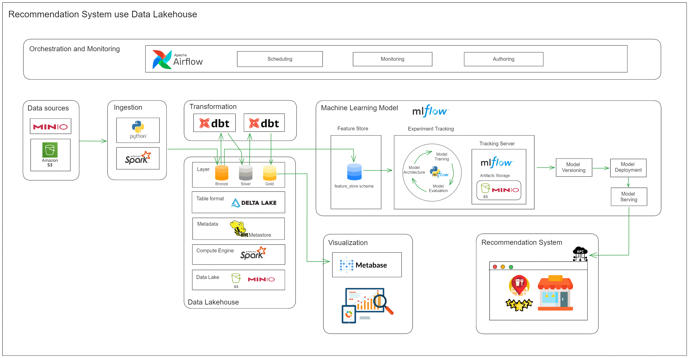
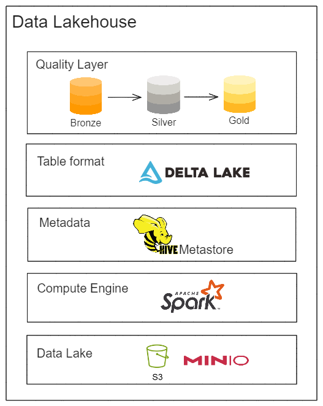

# lakehouse on local 

## System Architecture



## Lakehouse Architecture


## Prepare infrastructure
```bash
docker compose up -d
```

## Prepare data
- Upload data to MinIO, see [README](../minio/README.md)

## Orchestrate pipeline
- Orchestrate pipeline, see [README](../airflow/README.md)

## Query data
- Query data, query on metabase, see [README](../metabase/README.md)

## Clean up
```bash
docker compose down
```

## References
- [Lakehouse](https://databricks.com/discover/data-management)
- [Lakehouse Architecture](https://databricks.com/session_na21/lakehouse-architecture)
- [Lakehouse: A New Generation of Open Platform for Data Analytics](https://databricks.com/session_na21/lakehouse-a-new-generation-of-open-platform-for-data-analytics)


