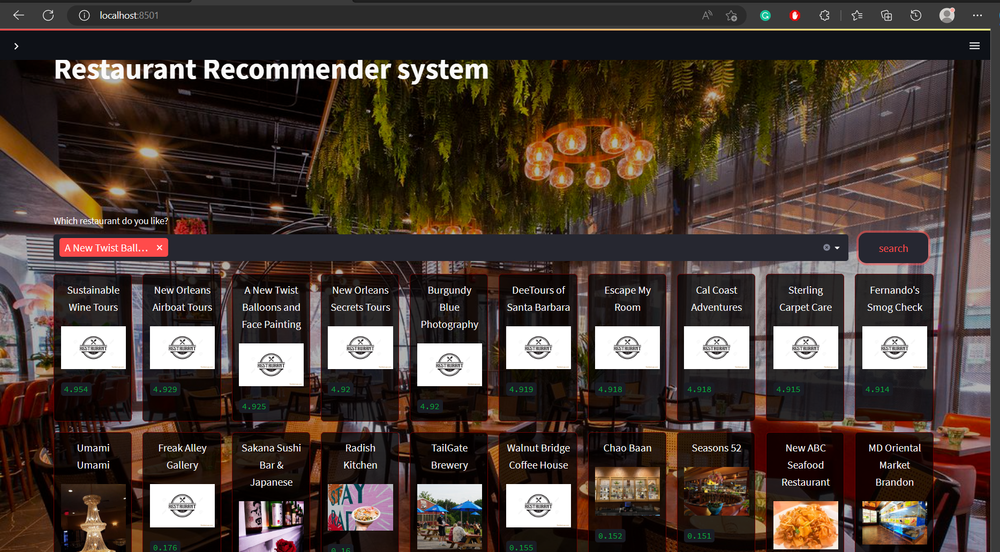

# Restaurant_Recommendartion

recommend to create virtual environment, eg python with Virtual env, conda with conda Virtual env

## Main WEB



Conda
```
conda create --name env_name python==3.8
conda activate env_name
conda install --file requirements.txt
streamlit run restaurant.py
```
Python:
```
py python -m venv VirtualEnv
.\VirtualEnv\Scripts\activate  
pip install -r requirements.txt
streamlit run restaurant.py
```